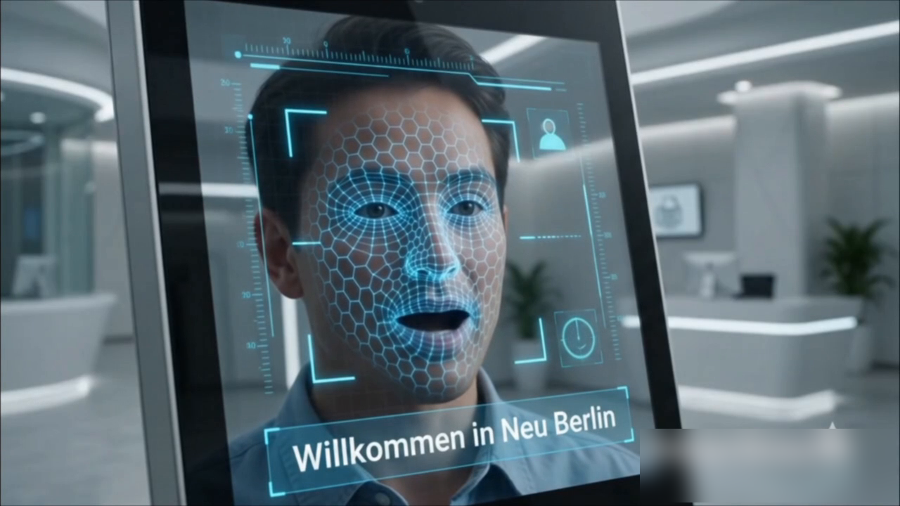
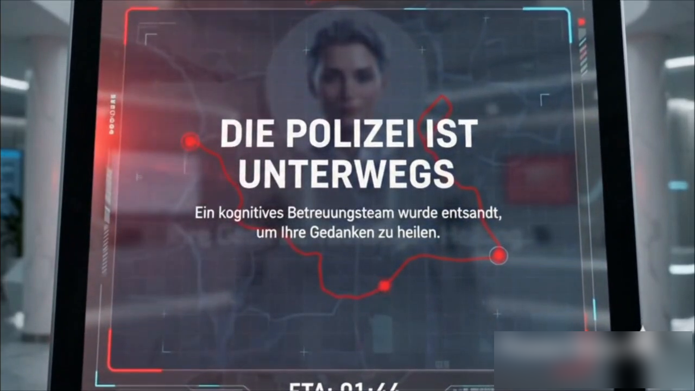

# Computer Says No: Can we lose touch with human decision making?

[](https://berlinscienceweek.com/)
[](#)
[](#)

An interactive roleplay simulation and installation investigating the friction between human agency and autonomous/agentic AI workflows in governance. 

Created for **Berlin Science Week 2026** under the **Art & Science Programme**, this project transforms abstract software architecture into an immersive, speculative theatrical experience.

---

## 🏛️ Project Overview

In a speculative future, a citizen enters a fully automated **"Bürgeramt" (town hall)** where human staff have been entirely replaced by a network of autonomous AI agents. 

Visitors engage in a seemingly standard digital application process, only to witness their simulated data being analyzed, "scraped," and cross-referenced across a "conspiracy" of corporate and state systems. As the installation performs simulated biometric risk assessments and searches simulated digital footprints, participants experience the helplessness of being a mere data point in an unyielding algorithm. The experience culminates in a final, unappealable verdict.

While the tone is Orwellian, the focus is on the software engineering of these systems: **how "agentic" decision-making removes the possibility of human appeal, and how we can lose a vital "human touch" in the architecture of modern governance.**

---

## 🧪 Scientific Grounding & Ethics

This installation serves as a physical, narrative representation of complex computer science and sociological debates:

*   **Agentic AI & Multi-Agent Reasoning:** Investigating systems designed to execute complex, multi-step goals with minimal human oversight.
*   **Automated Decision-Making Systems (ADM):** Questioning the social and legal impacts when algorithmic predictions replace human discretion.
*   **Algorithmic Bias & Surveillance Capitalism:** Exploring how data "scraping" and profiling propagate historical biases and threaten data sovereignty.
*   **Human-in-the-Loop (HITL) Design:** Highlighting the critical technical challenges and absolute necessity of maintaining human oversight in automated infrastructure.

---

## 🎭 The Installation Experience

```
[ Visitor enters Bürgeramt ] 
          │
          ▼
┌─────────────────────────────────┐
│ Digital Application & Interface │ <-- Visitor enters details, presses physical buttons
└─────────────────────────────────┘
          │
          ▼
┌─────────────────────────────────┐
│     Multi-Agent Analysis        │ <-- Autonomous AI agents "scrape" simulated data
└─────────────────────────────────┘
          │
          ▼
┌─────────────────────────────────┐
│  Conspiracy of State & Corp     │ <-- Data analyzed across simulated corporate networks
└─────────────────────────────────┘
          │
          ▼
┌─────────────────────────────────┐
│   Biometric Risk Assessment     │ <-- AI evaluates digital footprint & profiles visitor
└─────────────────────────────────┘
          │
          ▼
┌─────────────────────────────────┐
│  Final, Unappealable Verdict    │ <-- "Computer says NO" (Zero human appeal possible)
└─────────────────────────────────┘
          │
          ▼
[ Shared Screen: Debrief & Science ] <-- Analyze outcomes, learn about GDPR, HITL, & ethics
```

*   **Physical Space:** Designed as a small, enclosed room-like office mimicking a sterile town hall.
*   **Interaction:** Large hardware buttons, interactive computer screens, and physical props.
*   **Debrief Zone:** Outside the installation, a large screen displays a real-time analysis of the interactive outcomes, shedding light on the underlying technology, current policy debates, and social impacts.
*   **GDPR & Privacy:** All visitor data used during the interaction is completely simulated and wiped immediately to ensure a safe, fully GDPR-compliant environment.

---

## 📺 The "Neu Berlin" Interactive Scenario

The project's immersive narrative and speculative UI flow are showcased in the **"Neu Berlin"** video simulation mockup:

1. **Biometric Face Scan (*"Willkommen in Neu Berlin"*):**
   * The citizen is greeted by a high-tech biometric face-scan overlay with a wireframe tracking HUD.
   
   
2. **Citizen Integration & Databases:**
   * An AI companion coordinates state and corporate databases under the motto of a paperless state office (*"Papierlose Behörde"*).
3. **Multi-Agent Risk Assessment:**
   * **Öffentliche Aufzeichnungen (Public Records):** The system maps and analyzes the citizen's real-time social connection network.
   * **Corpo-AI Daten-Feed (Corporate Feed):** Correlates and flags automatic anomalies and risk profiles, including:
     * *Einkaufshistorie / Anomalie* (Purchase History Anomaly)
     * *Nicht genehmigter Aufenthaltsort / Risiko* (Unapproved Location Risk)
     * *Soziale Verbindungen / Risiko* (Social Connection Risk)
4. **The Final Verdict:**
   * Under the seal of the automated administration (**"NEUERMASCHINE NEU BERLIN — HELDENHAFT UND UNTERTAN"** / *Heroic and Obedient*), the system issues its unappealable verdict:
     > **"Grund: Unzureichender Score für zivilgesellschaftliche Harmonie. Algorithmische Entscheidung ist endgültig. Keine Einspruchsmöglichkeit."**
     > *(Reason: Insufficient score for civil-societal harmony. Algorithmic decision is final. No possibility of appeal.)*
5. **Dystopian Escalation:**
   * The AI companion calmly warns: **"Ihre Gedanken benötigen Heilung."** *(Your thoughts require healing.)*
6. **Immediate State Intervention:**
   * A flashing red emergency dispatch override screen appears, signaling immediate physical enforcement:
     > **"DIE POLIZEI IST UNTERWEGS. Ein kognitives Betreuungsteam wurde entsandt, um Ihre Gedanken zu heilen. ETA: 01:44"**
     > *(THE POLICE ARE ON THEIR WAY. A cognitive care team has been dispatched to heal your thoughts. ETA: 01:44)*
     
   

---

## 💻 Technical Implementation

This repository hosts the software and hardware blueprints for the installation:
*   **Agentic Workflows:** Multi-agent architectures executing goal-driven tasks.
*   **Local AI Execution:** Powered by OLLAMA / local LLM engines running on local GPU hardware (to avoid data leakage and ensure reliability).
*   **Interactive UI:** High-fidelity UI prototypes representing future governance systems.
*   **Hardware Integration:** Custom embedded software and microcontrollers interface physical inputs (buttons/sensors) with the AI network.

---

## 🗓️ Event & Exhibition Details

*   **Dates:** 6 - 8 November 2026
*   **Location:** Berlin Science Week 2026 (Art & Science Programme)
*   **Format:** Interactive Installation (Off-Stage)
*   **Event Track:** Trust & Responsibility
*   **Target Audience:** Fully accessible to all age groups and backgrounds, from school students (12+) to seniors. No prior technical knowledge is required.

---

## 📁 Repository Contents

*More project folders (source code, hardware designs, UI templates) will be populated as development continues!*

---

*This project is currently in active development. If you are interested in collaborating, supporting the development, or hosting the installation, feel free to reach out!*
